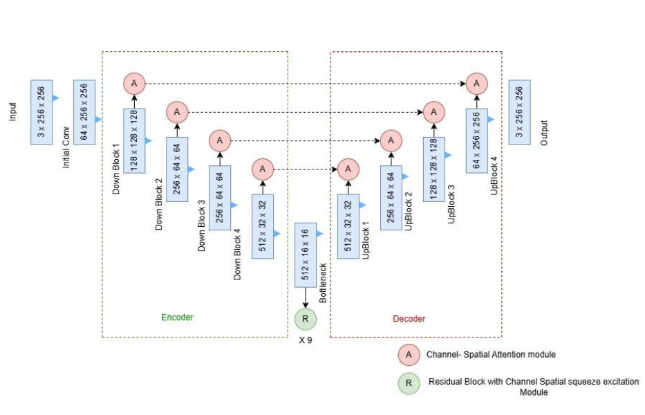
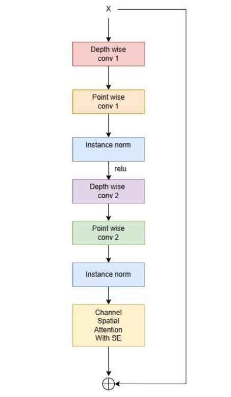
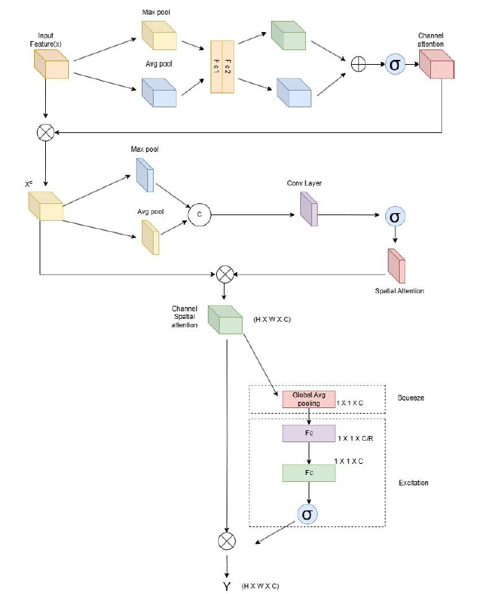
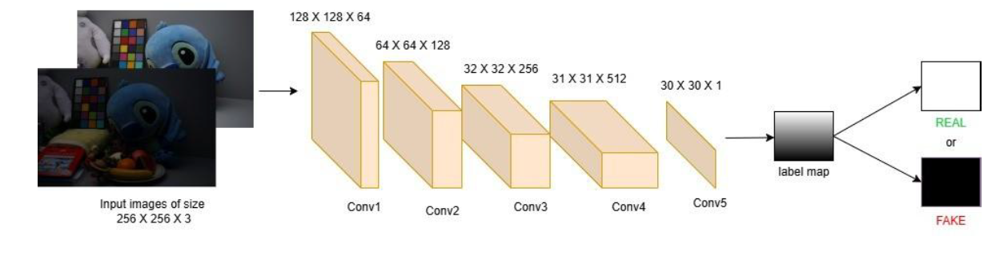
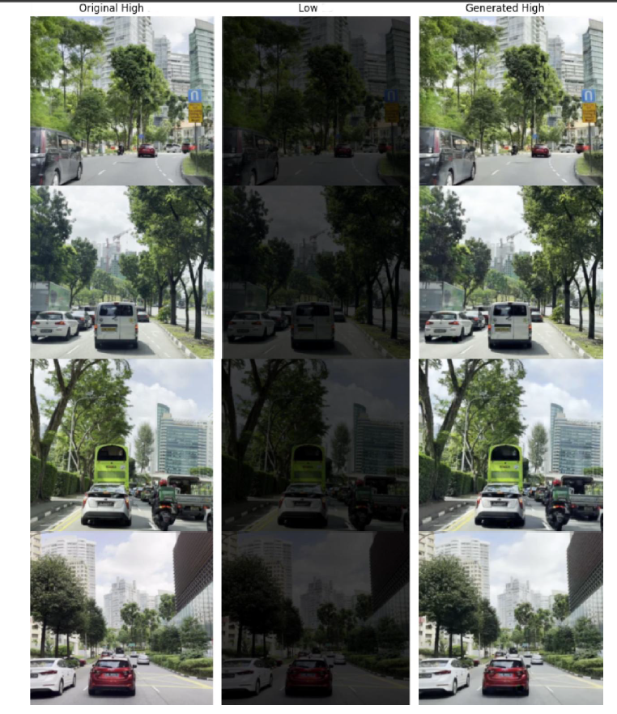

# Dual-Attention GAN: A Robust Framework for Low-Light Image Enhancement using Efficient Residual Blocks

[](https://github.com/irtazirfan08-source/Dual-Attention-GAN-LLIE/actions/workflows/ci.yml)
[](https://pytorch.org/)
[](https://www.python.org/)
[](https://efast.pust.ac.bd)
[](LICENSE)

Official implementation and model architecture for the undergraduate research thesis conducted at **East Delta University** and presented at **EFAST 2026**.

---

## 👥 Authors & Academic Affiliation

* **Author:** Irtaz Irfan (Student ID: 221008612)
* **Supervisor:** Golam Moktader Daiyan, Assistant Professor
* **Department:** Computer Science & Engineering, School of Science, Engineering & Technology
* **Institution:** East Delta University, Chittagong, Bangladesh
* **Defense Date:** March 2026 (Grade: A / 4.00 CGPA)

---

## 📖 Abstract

Low-light image enhancement is critical for downstream computer vision tasks like autonomous driving and surveillance, which suffer under severe visibility degradation, intensive noise, and color distortion. To overcome the generalization limits of traditional priors and the heavy overhead of deep learning models, this thesis proposes an advanced Generative Adversarial Network (GAN) optimized for high-fidelity restoration.

The framework features a U-Net generator integrated with nine sequential Efficient Residual Blocks for multi-scale feature extraction without spatial resolution loss. It introduces a dual-attention mechanism combining Enhanced Channel-Spatial and Squeeze-and-Excitation (SE) modules to dynamically recalibrate spatial and channel feature dependencies, balancing illumination adjustment with noise suppression. Adversarially, a Spectrally Normalized Patch-GAN discriminator enforces localized structural constraints to preserve sharp, high-frequency textures. Validated on the LoLI-Street dataset, the model achieves a Peak Signal-to-Noise Ratio (PSNR) of 32.21 dB, a Structural Similarity Index (SSIM) of 0.9678, and a Learned Perceptual Image Patch Similarity (LPIPS) score of 0.0172, significantly outperforming state-of-the-art benchmarks including Retinexformer and CUE.

---

## 🏛️ System Architecture

### 1. U-Net Generator with Attention Bottleneck
The generator adopts a symmetric U-Net encoder-decoder structure. The skip connections allow the direct transfer of low-level feature maps from encoder to decoder, while the bottleneck houses 9 Efficient Residual Blocks:

<p align="center">
  
</p>

### 2. Efficient Residual Block & Dual-Attention Mechanism
Each residual block decouples spatial filtering from channel mixing using Depthwise Separable Convolutions, combined with Channel-Spatial Attention and Squeeze-and-Excitation (SE) feature recalibration:

<p align="center">
  
  &nbsp;&nbsp;&nbsp;&nbsp;
  
</p>

### 3. Spectrally Normalized PatchGAN Discriminator
A 5-layer fully convolutional network that classifies local image patches with Spectral Normalization to stabilize minimax optimization and prevent mode collapse:

<p align="center">
  
</p>

---

## 📐 Loss Formulation & Optimization

The network is trained end-to-end to minimize a composite objective function:

$$\mathcal{L}_{\text{Total}} = \mathcal{L}_{\text{GAN}}(G, D) + \lambda \mathcal{L}_1(G)$$

$$\mathcal{L}_{\text{GAN}}(G, D) = \mathbb{E}_{y}[\log D(y)] + \mathbb{E}_{x}[\log(1 - D(G(x)))]$$

$$\mathcal{L}_1(G) = \mathbb{E}_{x, y}[\Vert y - G(x) \Vert_1]$$

* **Reconstruction Weight:** $\lambda = 100$
* **Optimizer:** Adam ($\beta_1 = 0.5, \beta_2 = 0.999$)
* **Learning Rates:** Generator = $2 \times 10^{-4}$, Discriminator = $1 \times 10^{-4}$
* **Training Schedule:** 50 epochs with batch size 32 on the LoLI-Street dataset

---

## 📂 Benchmark Dataset

The model is trained and benchmarked on the **LoLI-Street Dataset**, an urban street-view low-light dataset featuring extreme illumination drops, uneven street lighting, high dynamic range shadows, and environmental glare:

<p align="center">
  
</p>

---

## 📊 Benchmark Results on LoLI-Street Dataset

Quantitative evaluation on the dense low-light split of the **LoLI-Street Benchmark Dataset** (5,000 paired training subset, 500 dense validation images):

| Method | Venue / Year | PSNR (dB) ↑ | SSIM ↑ | LPIPS ↓ |
| :--- | :---: | :---: | :---: | :---: |
| Retinexformer | ICCV 2023 | 27.87 | 0.3398 | 0.3037 |
| SCI | CVPR 2022 | 27.79 | 0.3394 | 0.3048 |
| PairLIE | CVPR 2023 | 27.66 | 0.8702 | 0.0357 |
| FourLLIE | ACM MM 2023 | 28.07 | 0.8828 | 0.1188 |
| RQ-LLIE | ICCV 2023 | 29.03 | 0.9167 | 0.0326 |
| CUE | ICCV 2023 | 30.58 | 0.9100 | 0.0201 |
| Diff-LL | ACM TOG 2023 | 31.04 | 0.9165 | 0.0273 |
| TriFuse | SOTA 2024 | 31.67 | 0.9214 | 0.0201 |
| LL-Former | AAAI 2023 | 31.62 | 0.9274 | **0.0131** |
| **Proposed Dual-Attention GAN (Ours)** | **Thesis 2026** | **32.21** | **0.9678** | 0.0172 |

---

## 🖼️ Qualitative Results

Visual enhancement comparison against ground truth clear frames and low-light degraded inputs:

<p align="center">
  
</p>

---

## 🚀 Getting Started

### 1. Environment Setup

Clone the repository and install dependencies:

```bash
git clone [https://github.com/irtazirfan08-source/Dual-Attention-GAN-LLIE.git](https://github.com/irtazirfan08-source/Dual-Attention-GAN-LLIE.git)
cd Dual-Attention-GAN-LLIE
pip install -r requirements.txt
